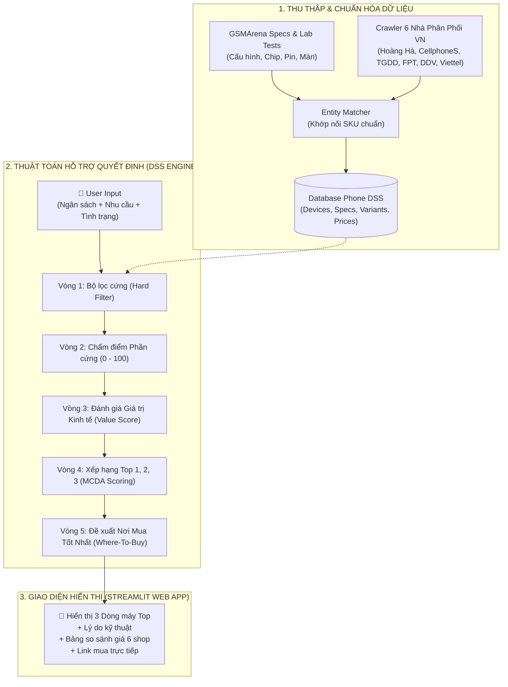
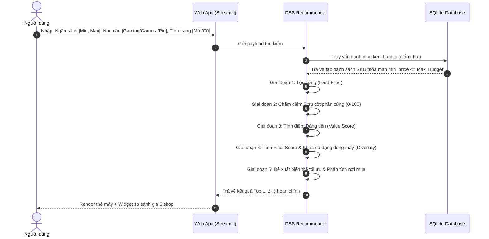
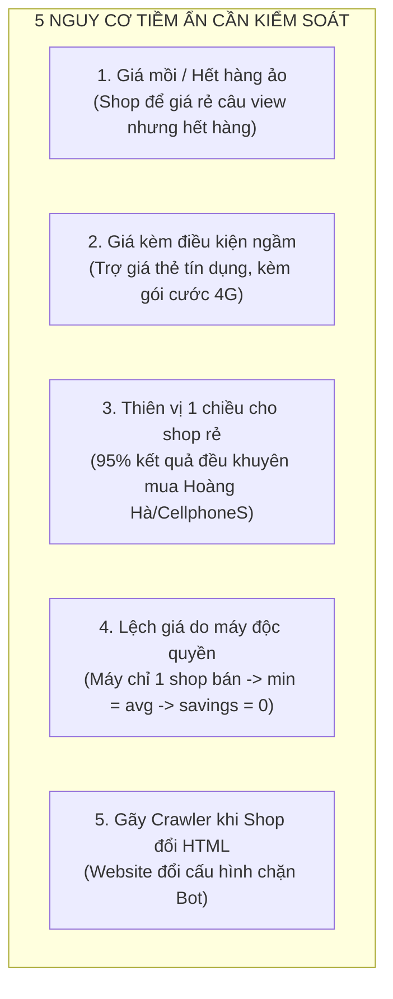

# 📱 TÀI LIỆU ĐẶC TẢ THUẬT TOÁN DSS & QUẢN TRỊ DỮ LIỆU GIÁ THỊ TRƯỜNG VIỆT NAM

> **Dự án**: Phone Decision Support System (Phone DSS)  
> **Mục tiêu**: Hỗ trợ người dùng ra quyết định chọn mua điện thoại tối ưu (Top 1, 2, 3) theo nhu cầu sử dụng + Khuyến nghị chính xác nơi mua rẻ nhất và uy tín tại 6 nhà bán lẻ lớn ở Việt Nam.  
> **Phiên bản tài liệu**: 2.0  
> **Ngày cập nhật**: 2026-09-13  

---

## 📑 MỤC LỤC
1. [Tổng quan Kiến trúc Hệ thống](#1-tổng-quan-kiến-trúc-hệ-thống)
2. [Thiết kế Mô hình Dữ liệu Đa tầng (Data Schema)](#2-thiết-kế-mô-hình-dữ-liệu-đa-tầng-data-schema)
3. [Luồng Thuật toán Quyết định Chi tiết (6 Giai đoạn)](#3-luồng-thuật-toán-quyết-định-chi-tiết-6-giai-đoạn)
4. [Phân tích 5 Nguy cơ & Rủi ro Tiềm ẩn](#4-phân-tích-5-nguy-cơ--rủi-ro-tiềm-ẩn)
5. [Giải pháp Phòng ngừa Kỹ thuật & Hướng dẫn Tinh chỉnh](#5-giải-pháp-phòng-ngừa-kỹ-thuật--hướng-dẫn-tinh-chỉnh)
6. [Đặc tả Giao diện Đầu ra (UI/UX Specification)](#6-đặc-tả-giao-diện-đầu-ra-uiux-specification)

---

## 1. Tổng quan Kiến trúc Hệ thống

Hệ thống hoạt động theo mô hình tách bạch giữa **Tầng Thu thập & Tổng hợp Dữ liệu (Offline Processing)** và **Tầng Đưa ra Quyết định Thời gian thực (Online Recommendation Engine)**:



---

## 2. Thiết kế Mô hình Dữ liệu Đa tầng (Data Schema)

Để tránh hiện tượng cào chung chung khiến dữ liệu bị méo mó, hệ thống quản lý dữ liệu ở cấp độ **SKU (Mỗi biến thể RAM/ROM là 1 bản ghi độc lập)**.

### 📊 Bảng 1: `devices` (Danh mục dòng máy)
* `device_id` (PK): Định danh duy nhất (vd: `xiaomi_redmi_note_13_pro_5g`, `apple_iphone_15_pro_max`).
* `brand`: Tên hãng (Apple, Samsung, Xiaomi, OPPO, HONOR...).
* `device_name`: Tên thương mại hiển thị (vd: `Redmi Note 13 Pro 5G`).
* `release_year`: Năm ra mắt.
* `image_url`: Đường dẫn ảnh sản phẩm chất lượng cao.

### 📊 Bảng 2: `device_specs` (Thông số phần cứng chi tiết)
* `device_id` (FK): Khóa ngoại liên kết bảng `devices`.
* `chipset`, `cpu`, `gpu`: Tên chip vi xử lý.
* `main_camera_mp`, `has_ois`, `optical_zoom_x`, `main_camera_aperture`: Thông số camera.
* `battery_mah`, `charging_w`: Dung lượng pin và công suất sạc.
* `refresh_rate_hz`, `display_type`, `resolution_width`, `resolution_height`: Thông số màn hình.
* `weight_g`, `thickness_mm`: Trọng lượng và độ mỏng.

### 📊 Bảng 3: `device_benchmarks` (Điểm hiệu năng chuẩn)
* `device_id` (FK)
* `antutu_base`: Điểm AnTuTu đo đạc từ phòng Lab (giữ nguyên theo con chip, không nhân ảo).
* `geekbench_single`, `geekbench_multi`: Điểm hiệu năng CPU đơn nhân/đa nhân.
* `score_camera`, `score_display`, `score_battery`: Điểm đánh giá thực tế từ Lab GSMArena.

### 📊 Bảng 4: `device_variants` (Phiên bản bộ nhớ SKU)
* `variant_id` (PK): vd `xiaomi_redmi_note_13_pro_5g_8_256`.
* `device_id` (FK): Thuộc dòng máy nào.
* `ram_gb`: Dung lượng RAM (4, 6, 8, 12, 16).
* `rom_gb`: Dung lượng bộ nhớ trong (64, 128, 256, 512, 1024).

### 📊 Bảng 5: `device_retailer_prices` (Chi tiết giá cào từ 6 shop)
* `price_id` (PK): Mã định danh dòng giá.
* `variant_id` (FK): Thuộc biến thể nào.
* `retailer`: Tên nhà bán lẻ (`HoangHaMobile` | `CellphoneS` | `TGDD` | `FPTShop` | `DiDongViet` | `ViettelStore`).
* `condition`: `new` (Mới 100% chính hãng) hoặc `used` (Cũ 99% / Like New).
* `price`: Giá bán thực tế (VNĐ).
* `original_price`: Giá niêm yết chưa giảm.
* `stock_status`: `in_stock` (Còn hàng) | `out_of_stock` (Hết hàng).
* `product_url`: Link trực tiếp đến trang sản phẩm của đại lý.
* `updated_at`: Thời gian cào giá.

### 📊 Bảng 6: `device_aggregated_prices` (Bảng giá tính sẵn phục vụ thuật toán)
* `variant_id` (PK)
* `min_price`: Mức giá rẻ nhất trong các shop **còn hàng** (`stock_status == 'in_stock'`).
* `best_retailer`: Tên shop có `min_price`.
* `best_retailer_url`: Link mua tại shop rẻ nhất.
* `avg_price`: Mức giá trung bình thị trường của phiên bản đó.
* `max_price`: Mức giá cao nhất tại các hệ thống lớn.
* `savings_amount`: Số tiền tiết kiệm được ($= \text{max\_price} - \text{min\_price}$).
* `retailers_count`: Số lượng shop đang kinh doanh phiên bản này.

---

## 3. Luồng Thuật toán Quyết định Chi tiết (6 Giai đoạn)



### 🔹 Giai đoạn 1: Bộ lọc cứng (Hard Filter)
1. **Lọc tình trạng**: Chỉ lấy các bản ghi có `condition == user_selected_condition`.
2. **Lọc ngân sách**: Điều kiện lọc:
   $$\text{min\_price} \le \text{user\_max\_budget} \quad \text{và} \quad \text{min\_price} \ge \text{user\_min\_budget}$$
   *(Sử dụng `min_price` của các shop còn hàng để không bao giờ loại bỏ oan những máy mà người dùng có thể mua được).*
3. **Cơ chế nới lỏng ngân sách (Smart Budget Relaxation)**:
   - Nếu trong khoảng giá tìm thấy $< 3$ dòng máy, hệ thống tự động mở rộng biên độ $\pm 7\%$ để tìm thêm máy ở cận trên (gợi ý nâng cấp) và cận dưới (gợi ý tiết kiệm).

---

### 🔹 Giai đoạn 2: Chấm điểm 5 trụ cột phần cứng (Thang điểm 0 - 100)

Mọi tiêu chí được chuẩn hóa về thang điểm $[0, 100]$ thông qua hàm `scale(value, min_val, max_val)`:

1. **Điểm Gaming & Hiệu năng (`gaming_score`)**:
   $$\text{gaming\_score} = (\text{Score}_{\text{AnTuTu}} \times 0.55) + (\text{Score}_{\text{RAM}} \times 0.20) + (\text{Score}_{\text{Hz}} \times 0.15) + (\text{Score}_{\text{Panel}} \times 0.10)$$
   * *Lưu ý*: AnTuTu giữ nguyên theo con chip thực tế, RAM được chấm theo ngưỡng hữu dụng (4GB = 50đ, 6GB = 75đ, 8GB = 90đ, 12GB+ = 100đ).

2. **Điểm Chụp ảnh & Quay phim (`camera_score`)**:
   $$\text{camera\_score} = (\text{Score}_{\text{MP}} \times 0.30) + (\text{Score}_{\text{OIS}} \times 0.30) + (\text{Score}_{\text{Zoom}} \times 0.25) + (\text{Score}_{\text{Aperture}} \times 0.15)$$
   * $\text{Score}_{\text{OIS}} = 100$ nếu có chống rung quang học, ngược lại $= 0$.

3. **Điểm Pin & Sạc nhanh (`battery_score`)**:
   $$\text{battery\_score} = (\text{Score}_{\text{mAh}} \times 0.65) + (\text{Score}_{\text{Watt}} \times 0.35)$$

4. **Điểm Màn hình hiển thị (`display_score`)**:
   $$\text{display\_score} = (\text{Score}_{\text{Hz}} \times 0.35) + (\text{Score}_{\text{Resolution}} \times 0.35) + (\text{Score}_{\text{Panel}} \times 0.30)$$

5. **Điểm Mỏng nhẹ (`thin_light_score`)**:
   $$\text{thin\_light\_score} = (\text{Score}_{\text{Weight}} \times 0.60) + (\text{Score}_{\text{Thickness}} \times 0.40)$$

6. **Điểm Cân bằng tổng thể (`balanced_score`)**:
   $$\text{balanced\_score} = \frac{\text{gaming} + \text{camera} + \text{battery} + \text{display} + \text{thin\_light}}{5}$$

---

### 🔹 Giai đoạn 3: Tính điểm "Đáng tiền / P/P" (`value_score`)

Điểm đáng tiền phản ánh tỷ lệ giữa **Chất lượng máy** và **Số tiền thực tế phải bỏ ra**:

* **Đối với Máy Mới (`new`)**:
  $$\text{raw\_value} = \frac{\text{balanced\_score}}{\text{min\_price} / 1.000.000}$$
  $$\text{value\_score} = \min\left(100.0, \; \frac{\text{raw\_value}}{12.0} \times 100.0\right)$$
  *(12 điểm chất lượng trên 1 triệu VNĐ là mốc tham chiếu xuất sắc).*

* **Đối với Máy Cũ (`used`)**:
  $$\text{condition\_score} = (\text{battery\_health} \times 0.50) + (\text{exterior\_score} \times 0.30) + (\text{warranty\_score} \times 0.20)$$
  $$\text{value\_score} = (\text{base\_value\_score} \times 0.65) + (\text{condition\_score} \times 0.35)$$

---

### 🔹 Giai đoạn 4: Tính điểm tổng kết (`final_score`) & Xếp hạng Top 1, 2, 3

Tùy theo số lượng ưu tiên mà người dùng lựa chọn:

* **Khi User chọn 1 ưu tiên chính** (ví dụ: Chuyên Gaming):
  $$\text{final\_score} = (\text{Score}_{\text{Ưu tiên 1}} \times 0.65) + (\text{value\_score} \times 0.20) + (\text{balanced\_score} \times 0.15)$$

* **Khi User chọn 2 ưu tiên** (ví dụ: Gaming + Pin trâu):
  $$\text{final\_score} = (\text{Score}_{\text{Ưu tiên 1}} \times 0.50) + (\text{Score}_{\text{Ưu tiên 2}} \times 0.30) + (\text{value\_score} \times 0.10) + (\text{balanced\_score} \times 0.10)$$

* **Khóa đa dạng hóa dòng máy (Diversity Constraint)**:
  - Gom nhóm (Group by) theo `device_id`.
  - Top 1, Top 2, Top 3 **bắt buộc phải thuộc về 3 dòng máy khác nhau**.

---

### 🔹 Giai đoạn 5: Đề xuất biến thể tối ưu & Nơi mua (Where-To-Buy Engine)

1. **Chọn biến thể RAM/ROM đại diện**:
   - Nếu User chọn *Gaming*: Ưu tiên biến thể có RAM cao nhất trong ngân sách.
   - Nếu User chọn *Camera/Lưu trữ*: Ưu tiên biến thể có ROM lớn nhất trong ngân sách.
   - Nếu User chọn *Cơ bản / Tiết kiệm*: Ưu tiên biến thể có `min_price` tốt nhất.
2. **Quyết định nơi mua (Tie-breaker Logic)**:
   - **Trường hợp 1 (Chênh lệch giá $> 150.000đ$)**: Khuyên mua tại shop có `min_price` $\rightarrow$ Nêu rõ số tiền tiết kiệm được so với giá trung bình.
   - **Trường hợp 2 (Giá giữa các shop ngang nhau $\le 150.000đ$)**: Đưa ra nhận xét cân bằng:
     - *"Giá tại các hệ thống tương đương nhau (~8.490.000đ). Khuyên bạn chọn FPT Shop / TGDD nếu cần nhiều điểm bảo hành gần nhà, hoặc chọn CellphoneS nếu có ưu đãi thành viên Smember."*

---

## 4. Phân tích 5 Nguy cơ & Rủi ro Tiềm ẩn

Trong quá trình vận hành thực tế tại thị trường Việt Nam, hệ thống có thể gặp phải 5 nguy cơ sau:



### ⚠️ Nguy cơ 1: Giá mồi / Hết hàng ảo (Ghost Pricing / Out-of-Stock)
* **Bản chất**: Shop hiển thị giá rất rẻ trên web nhưng khi click vào thì trạng thái là "Hết hàng" hoặc "Chỉ có tại 1 cửa hàng ở Cà Mau".
* **Tác hại xấu**: Thuật toán lấy mức giá ảo đó để tính điểm, đẩy máy lên Top 1. Khi người dùng bấm vào link thì không mua được $\rightarrow$ **Mất hoàn toàn uy tín của hệ thống DSS.**

### ⚠️ Nguy cơ 2: Giá kèm điều kiện ẩn (Hidden Conditions / Subsidies)
* **Bản chất**: Mức giá hiển thị đã bị trừ các khuyến mãi không phải ai cũng có (Mở thẻ tín dụng VPBank giảm 1 triệu, Trợ giá thu cũ đổi mới 2 triệu, hoặc Cam kết dùng gói cước mạng Viettel 12 tháng).
* **Tác hại xấu**: Người dùng ra cửa hàng mua bị tính giá cao hơn giá hệ thống hiển thị.

### ⚠️ Nguy cơ 3: Thiên vị một chiều cho Shop giá rẻ (Retailer Monopolization Bias)
* **Bản chất**: Hoàng Hà Mobile và CellphoneS thường xuyên có giá niêm yết thấp hơn TGDD/FPT từ 5% - 15%.
* **Tác hại xấu**: Hệ thống gần như 100% các lần tìm kiếm đều chỉ khuyên mua tại Hoàng Hà. Người dùng ở vùng sâu/huyện/xã (chỉ có Thế Giới Di Động & FPT Shop) sẽ cảm thấy công cụ không hữu ích.

### ⚠️ Nguy cơ 4: Lệch giá trung bình đối với máy độc quyền / ít bên bán
* **Bản chất**: Những mẫu máy đặc thù (Infinix, Nubia gaming, ROG Phone) chỉ có duy nhất 1 hoặc 2 đại lý phân phối độc quyền.
* **Tác hại xấu**: Khi chỉ có 1 shop bán, $\text{min\_price} = \text{avg\_price} \rightarrow \text{Tiết kiệm} = 0đ$. Thuật toán có thể ngộ nhận máy này "không có ưu đãi giảm giá" so với các máy bán ở 6 shop.

### ⚠️ Nguy cơ 5: Hỏng hóc bộ cào (Scraper Fragility & DOM Drift)
* **Bản chất**: Các nhà bán lẻ thường xuyên cập nhật website, thay đổi class CSS, đổi cấu trúc GraphQL hoặc bật Cloudflare WAF chặn IP.
* **Tác hại xấu**: Dữ liệu giá bị cũ (stale data), hoặc giá bị trả về `null` dẫn đến máy bị ẩn mất khỏi hệ thống.

---

## 5. Giải pháp Phòng ngừa Kỹ thuật & Hướng dẫn Tinh chỉnh

Dưới đây là các cơ chế lập trình bắt buộc để triệt tiêu 5 nguy cơ trên:

| Nguy cơ | Giải pháp Kỹ thuật trong Mã Nguồn | Vị trí File Code cần kiểm tra |
| :--- | :--- | :--- |
| **1. Hết hàng ảo** | Bộ cào bắt buộc bóc tách cờ `is_available` / `stock_status`. Chỉ những bản ghi `in_stock == True` mới được đưa vào hàm tính `min_price`. | `crawler/src/priceParser.js` |
| **2. Điều kiện ẩn** | Chỉ bóc tách trường `final_cash_price` (giá thanh toán tiền mặt/chuyển khoản), bỏ qua các thẻ chứa từ khóa `"kèm gói cước"`, `"trợ giá thu cũ"`, `"mở thẻ"`. | `crawler/src/priceParser.js` |
| **3. Thiên vị shop rẻ** | Hiển thị **Bảng ma trận giá công khai của cả 6 shop** kèm trạng thái còn hàng. Bổ sung ghi chú về bảo hành thuận tiện của TGDD / FPT Shop. | `phone_dss/web_app.py` |
| **4. Máy độc quyền** | Nếu `retailers_count <= 2`, hệ thống tự động gắn nhãn: `[⭐ Hàng phân phối độc quyền]` thay vì tính % tiết kiệm so với trung bình. | `phone_dss/recommender.py` |
| **5. Gãy Crawler** | Xây dựng cơ chế **Cache & Fallback (TTL 7 ngày)**. Nếu cào hôm nay bị lỗi, giữ nguyên giá hợp lệ của ngày hôm trước kèm cảnh báo log. | `crawler/syncAndAudit.js` |

---

## 6. Đặc tả Giao diện Đầu ra (UI/UX Specification)

Mỗi kết quả Top trong giao diện Web App sẽ được hiển thị theo cấu trúc chuẩn hóa:

```text
┌────────────────────────────────────────────────────────────────────────────────────────┐
│ 🥇 TOP 1: Xiaomi Redmi Note 13 Pro 5G [Bản 8GB RAM / 256GB ROM]                        │
│ ⭐ Điểm DSS: 91.8 / 100  |  Phân khúc: Tầm trung cận cao cấp                           │
│ 🎯 Lý do chọn: Màn hình 1.5K 120Hz siêu nét, Camera 200MP chống rung OIS hàng đầu.     │
├────────────────────────────────────────────────────────────────────────────────────────┤
│ 🛒 KHUYẾN NGHỊ NƠI MUA (WHERE TO BUY):                                                 │
│                                                                                        │
│  📊 Mặt bằng giá thị trường: ~7.990.000đ                                               │
│  🏆 NƠI MUA TỐT NHẤT: Hoàng Hà Mobile - 7.490.000đ                                     │
│     💡 Bạn tiết kiệm được: 500.000đ so với giá trung bình thị trường!                  │
│                                                                                        │
│  [ 👉 BẤM VÀO ĐÂY ĐỂ MUA TẠI HOÀNG HÀ MOBILE (7.490.000đ) ]                           │
│                                                                                        │
│  📋 Bảng đối soát giá tại 6 nhà bán lẻ lớn:                                            │
│   • Hoàng Hà Mobile: 7.490.000đ  (✅ Còn hàng - Rẻ nhất)       -> [Xem tại Hoàng Hà]  │
│   • CellphoneS:      7.690.000đ  (✅ Còn hàng)                 -> [Xem tại CellphoneS]│
│   • Di Động Việt:    7.790.000đ  (✅ Còn hàng)                 -> [Xem tại DDV]       │
│   • Viettel Store:   7.890.000đ  (✅ Còn hàng)                 -> [Xem tại Viettel]   │
│   • FPT Shop:        7.990.000đ  (✅ Còn hàng - Bảo hành 18th) -> [Xem tại FPT Shop]  │
│   • Thế Giới Di Động:8.190.000đ  (✅ Còn hàng - Nhiều shop)    -> [Xem tại TGDD]      │
│                                                                                        │
│ 💾 Chuyển đổi phiên bản bộ nhớ khác:                                                  │
│    [  Bản 8GB/128GB: 6.990.000đ  ]                                                     │
│    [🔘 Bản 8GB/256GB: 7.490.000đ (⭐ Khuyên dùng)]                                     │
│    [  Bản 12GB/512GB: 8.490.000đ ]                                                     │
└────────────────────────────────────────────────────────────────────────────────────────┘
```

---
*Tài liệu này được lưu trữ trực tiếp tại thư mục gốc của dự án để làm kim chỉ nam phát triển và bảo trì hệ thống DSS.*

